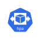
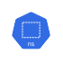
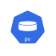
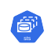

# Icones

## Common

| Name     | Icon |
| ----     | ---- |
| app      |  |
| binary   |  |
| laptop   |  |
| mail     |  |
| usb      |  |
| user     |  |

## Infra

| Name     | Icon |
| ----     | ---- |
| cloud    |  |
| database |  |
| docker   |  |
| firewall |  |
| kubernetes |  |
| proxy    |  |
| wifi     |  |
| worldwide |  |

## Kubernetes

| Name          | Icon |
| ----          | ---- |
| kube_crole    |  |
| kube_cm       |  |
| kube_crb      |  |
| kube_cronjob  |  |
| kube_deploy   |  |
| kube_ds       |  |
| kube_ep       |  |
| kube_group    |  |
| kube_hpa      |  |
| kube_ing      |  |
| kube_job      |  |
| kube_limits   |  |
| kube_netpol   |  |
| kube_ns       |  |
| kube_pod      |  |
| kube_psp      |  |
| kube_pv       |  |
| kube_pvc      |  |
| kube_quota    |  |
| kube_rb       |  |
| kube_role     |  |
| kube_rs       |  |
| kube_sa       |  |
| kube_sc       |  |
| kube_secret   |  |
| kube_sts      |  |
| kube_svc      |  |
| kube_vol      |  |

## License

All Kubernetess SVG icons collect from: [link](https://github.com/kubernetes/community/blob/master/icons/README.md)